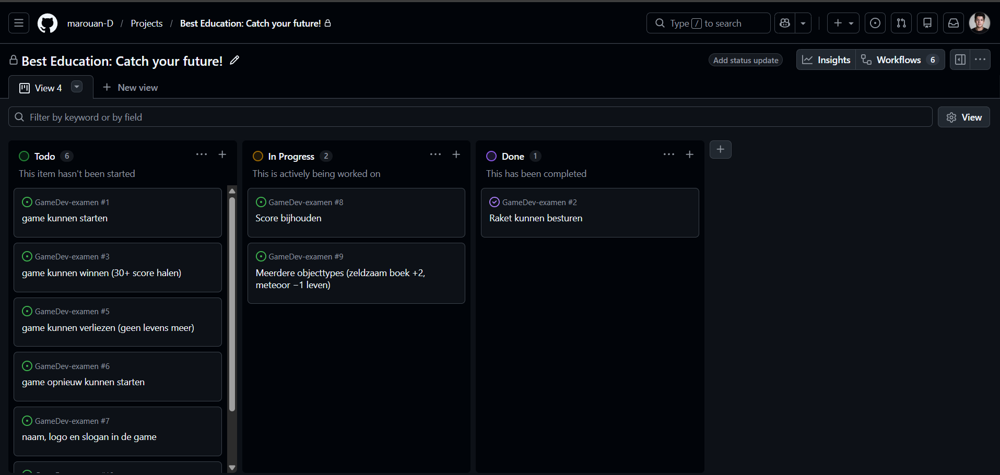

# Logboek KD: Game Development 

**Naam:** Marouan
**Project:** Falling objects catcher voor Best Education B.V.

---

## 25-05-2026

Game project gestart en alle documenten doorgenomen. Unity 6.4 en Mapstructuur opgezet met een map per opdracht.

## 26-05-2026

Game gekozen: een falling objects catcher. Gekozen omdat alle MUSTs er makkelijk in passen en leuk voor de leeftijds categorie (15-18). GitHub-repo aangemaakt en gekoppeld. Scrum board gemaakt met de user stories (backlog). GDD ingevuld en een sketch in Figma erbij gemaakt. Ontwikkelomgeving-document gemaakt. GDD naar mevrouw Jacobs gestuurd voor check.

## 28-05-2026

GDD besproken met mevrouw Jacobs. Feedback verwerkt: controls-uitleg toegevoegd, doelscore op 30 gezet, en meerdere objecttypes hoger geprioriteerd dan difficulty scaling. Presentatie staat ingepland voor 3 juni. Opdracht B (GDD + ontwikkelomgeving) gepushed naar GitHub.

Raket in de scene gezet, geschaald en geroteerd. PlayerMovement-script geschreven met `Input.GetAxisRaw` om de raket links/rechts te laten bewegen met de pijltjestoetsen of A/D. Liep tegen een bug aan: raket bewoog schuin door de rotatie van de sprite. Opgelost door `Space.World` mee te geven aan `transform.Translate`, zodat 'ie de wereld-assen gebruikt in plaats van zijn eigen lokale assen.

